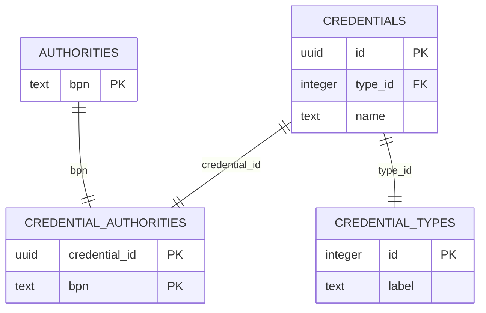

# Database View

- [Database View](#database-view)
  - [Database Overview](#database-overview)
  - [Database Structure](#database-structure)
    - [Enum Value Tables](#enum-value-tables)
    - [Mapping Tables](#mapping-tables)
    - [Credentials](#credentials)
  - [NOTICE](#notice)

## Database Overview

## Database Structure

The database is organized into several key tables, each serving a specific purpose:

### Enum Value Tables

`credential_types` is a table designed to store enum values. They contain an id and label, derived from the backend enums.

### Mapping Tables

`credential_authorities` is used to map entities.

### Credentials

The `credentials` table is utilized to safe the credentials.

## NOTICE

This work is licensed under the [Apache-2.0](https://www.apache.org/licenses/LICENSE-2.0).

- SPDX-License-Identifier: Apache-2.0
- SPDX-FileCopyrightText: 2024 Contributors to the Eclipse Foundation
- Source URL: <https://github.com/eclipse-tractusx/ssi-authority-schema-registry>
