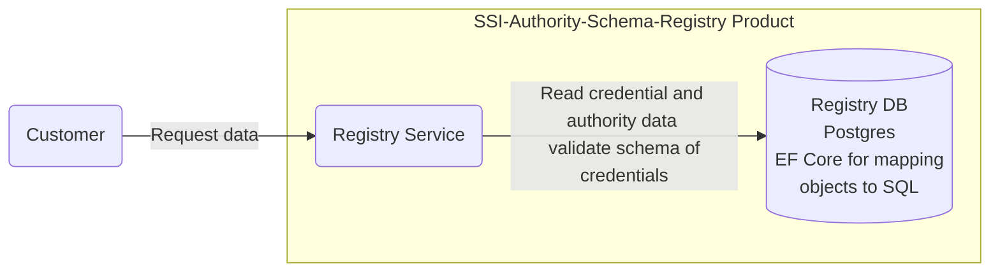

# Security Assessment SSI Authority & Schema Registry

|                           |                                                                                                          |
| :------------------------ | :------------------------------------------------------------------------------------------------------- |
| Contact for product       | [@evegufy](https://github.com/evegufy)   [@jjeroch](https://github.com/jjeroch)                       |
| Security responsible      | tbd                                                                                                      |
| Version number of product | 1.0.0                                                                                                    |
| Dates of assessment       | tbd                                                                                                      |
| Status of assessment      | Done & Approved                                                                                          |

## Product Description

The SSI Authority & Schema Registry product is a readonly REST API project, so a pure backend component (without implementation of an user interface).

The main purpose of the product is to provide the possibility to receive information about available credentials and their authorities. Furthermore, it can validate credential schemas.

The SSI Authority & Schema Registry comprises the technical foundation for functional interaction, monitoring and further functionalities.

The product can be run anywhere: it can be deployed as a docker image, e.g. on Kubernetes (platform-independent, cloud, on prem or local).

The SSI Authority & Schema Registry is using following key frameworks:

- .Net
- Entity Framework

[Development Concept](./Development%20Concept.md)

## Data Flow Diagram

### Additional information

* The customer can request the available credentials with their providing authorities.
* It is possible to validate the schema of credentials.
* All actions are logged within the Registry DB.

### Changes compared to last Security Assessment

N/A

### Features for Upcoming Versions

N/A

## Threats & Risks

tbd

### Mitigated Threats

N/A

### Performed Security Checks

- Static Application Security Testing (SAST) - CodeQL
- Software Composition Analysis (SCA) - Dependabot
- Container Scan conducted - Trivy
- Infrastructure as Code - KICS
- Secret Scanning - GitGuardian
- Dynamic Application Security Testing (DAST) - OWASP ZAP (Unauthenticated)

## NOTICE

This work is licensed under the [Apache-2.0](https://www.apache.org/licenses/LICENSE-2.0).

- SPDX-License-Identifier: Apache-2.0
- SPDX-FileCopyrightText: 2024 Contributors to the Eclipse Foundation
- Source URL: https://github.com/eclipse-tractusx/ssi-authority-schema-registry
